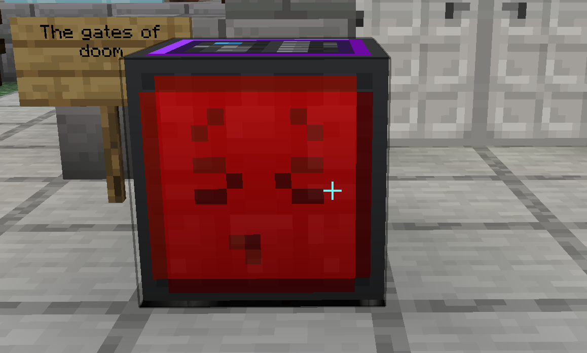
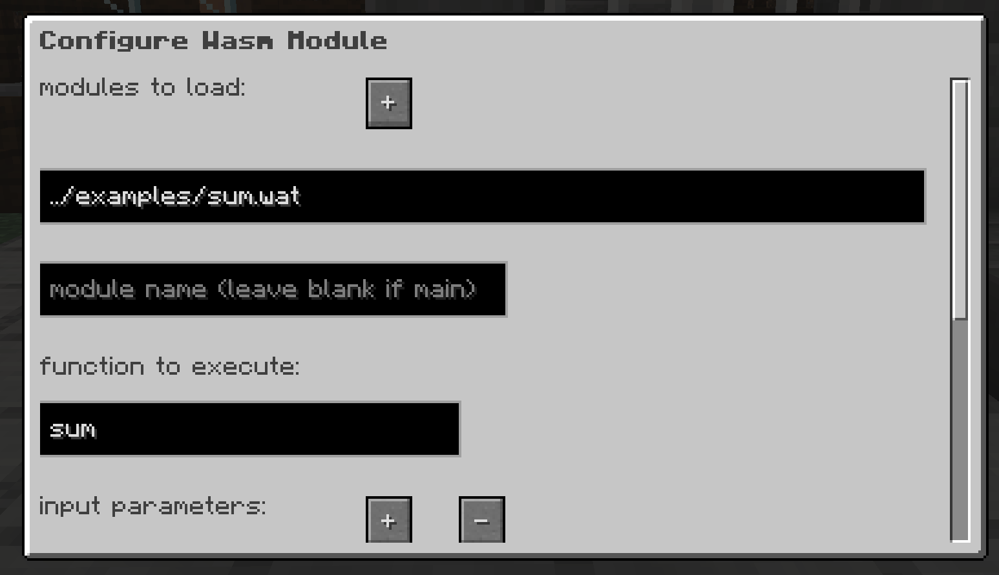
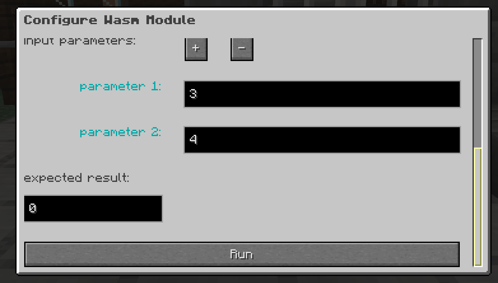

# Microservices in MineCraft Fabric Mod

Documentation WIP.

## Requirements:
* Minecraft 1.21.1
* Fabric https://fabricmc.net


## Webserver Block
The webserver block is a block that can be placed in the world and will start 
a webserver on the specified port. For each request it receives it will output
a data item with the request body and the request_id.

To send a response to the client, you can insert a data item with the correct
request_id. When a data item with the a request_id is inserted into a database
block the request_id will be automatically added to any response from the database.

## Database Block
The database block is a block that can be placed in the world that allows interaction
with a postgres database. A query is trigger by adding a data item to the block.
If this data item comes from a Webserver block and contains a request_id.
It will automatically add the request_id to any response from the database.

The query that the database executes will automatically be serialized to JSON and
added to the response data item. This can then be used to send a response to the client
using the Webserver block.

## WASM Block
To run a WASM module in MineCraft first place a `wasmcraft` block.



Once the block has been placed you can right click on the block to bring up the configuration menu.



In this menu configure the name of the module you would like to load (filepaths are relative to the MineCraft folder).

Set the module name if using multiple modules.

Configure your parameters, If the parameter is a string, Wasmcraft will automatically attempt to write this to the modules
memory. This feature requires the module to expose the functions `allocate` and `deallocate`, please see the example Go ABI
for more info (./examples/go_complex/abi/abi.go)



Configure the expected value, all functions that are executed by WasmCraft require that the function has a return value.
This can either be a String pointer or a simple I32.

Finally press the `run` button and `esc` to dismiss the menu. If the function executed correctly and the exepected
value matches the value returned from the function the block will change to `a green smily face`.

### Example modules

#### Go Simple ./examples/go_simple
Simple Go module with Wasi compiled with TinyGo

#### Go String ./examples/go_string
Example showing how to interact with Wasm memory allowing complex types

#### Go Complex ./examples/go_complex
Example implementing AES encyption and decryption as a WASM module. Leverages WASI filesystem.

#### AssemblyScript ./examples/assemblyscript
Various examples including writing and reading to WASM memory and complex types

#### Rust ./examples/rust
Various examples showing complex types, host functions and imported module functions

### References

* wasmtime-java https://github.com/kawamuray/wasmtime-java
* TinyGo https://tinygo.org
* Wasmtime docs https://docs.wasmtime.dev
* WASI - https://github.com/WebAssembly/WASI
* WASI Networking - https://github.com/WebAssembly/WASI/pull/312

## Interpolation
The database and webserver blocks both support interpolation for their configuration.
This enables you to use environment variables, the content of files or json path.

### Environment Variables
You can use environment variables in the configuration by using the following syntax:

```shell
${{env("name")}}
```

This would result in the value of the environment variable `MICROSERVICES_name` being used
as a replacement for the interpolation.

Note: For security Only environment variables prefixed with `MICROSERVICES_` will be available
for interpolation.

### File Content

You can use the content of a file in the configuration by using the following syntax:

```shell
${{file("path")}}
```

### JSON Path

JSON Path is a way to extract data from a JSON object. You can use JSON Path in the configuration

```shell
${{json_path('{"name":"nic"}','$.name')}}
```

Note: interpolation functions can be used as parameters for interpolation functions
the following would be valid.

```shell
${{json_path('${{file("myfile.json")}}','$.name')}}
```

###


## Running the example server and database

You can run an example server which has access to a postgres database. 
The server will be running on `minecraft.container.local.jmpd.in:25565` and the 
database will be running on `postgres.container.local.jmpd.in:5432`.

To connect to the database you can use the following credentials:
* Username: `postgres`
* Password: `password`
* Database: `minecraft`

```shell
➜ jumppad up ./jumppad
```

```shell
Running configuration from  ./jumppad  -- press ctrl c to cancel

INFO Creating resources from configuration path=/home/nicj/go/src/github.com/hashicraft/fabric-microservices-mod/jumppad
INFO Creating ImageCache ref=resource.image_cache.default
INFO Creating output ref=output.POSTGRES_DATABASE
INFO Creating output ref=output.POSTGRES_PASS
INFO Creating output ref=output.POSTGRES_USER
INFO Building image context=/home/nicj/go/src/github.com/hashicraft/fabric-microservices-mod/jumppad/minecraft/Docker dockerfile=Dockerfile image=jumppad.dev/localcache/minecraft_dev:WJy4LO-l
INFO Creating Network ref=resource.network.local
INFO Generating template ref=resource.template.db_username checksum="" source=postgres output=/home/nicj/.jumppad/data/db_secrets/username
INFO Generating template ref=resource.template.db_password checksum="" source=postgres output=/home/nicj/.jumppad/data/db_secrets/password
INFO Creating Container ref=resource.container.postgres
INFO Creating Container ref=resource.container.minecraft
INFO Creating output ref=output.POSTGRES_ADDR
```